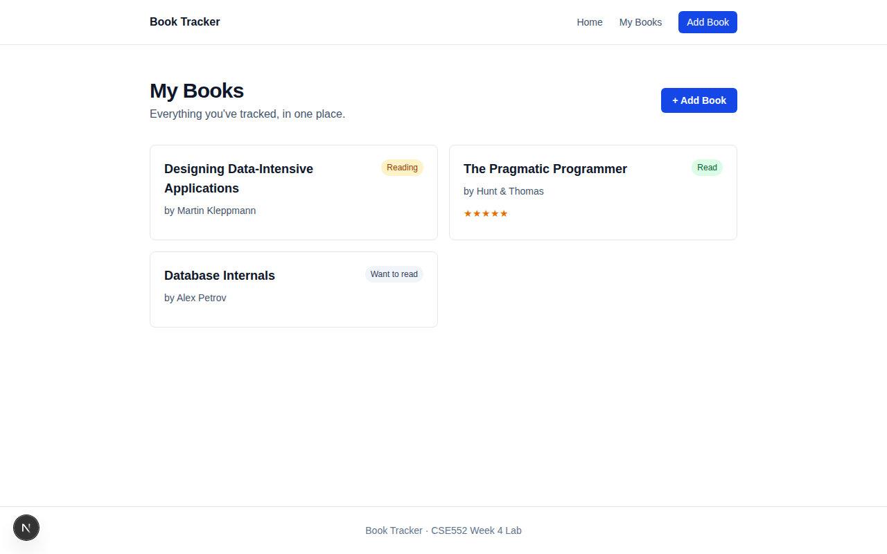
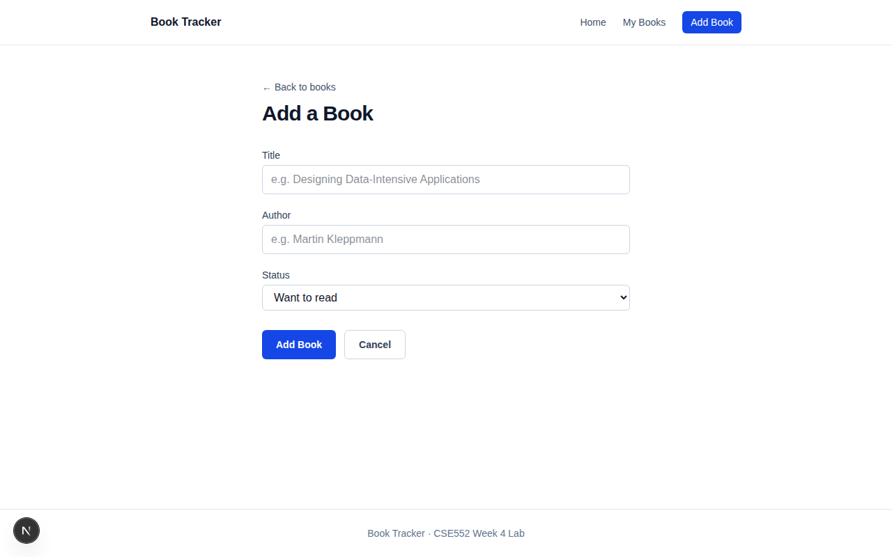
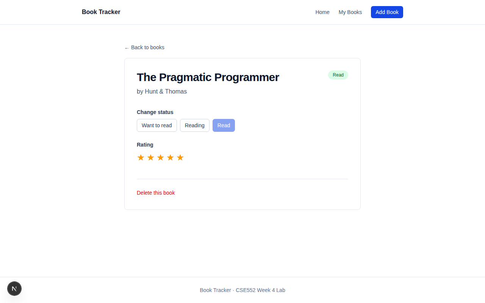

# Next.js Full-Stack CRUD UI

> Next.js App Router frontend for a FastAPI + Postgres backend. Four pages, full CRUD on a `books` resource, dynamic routes, loading and error states on every fetching page, env-driven API base URL.


Backend: [fastapi-postgres-crud](https://github.com/Auth3nticAI/fastapi-postgres-crud)

---



## What's interesting

- **Dynamic route** at `app/books/[id]/page.tsx` — Next 16's async `params: Promise<{id: string}>` unwrapped with `use()` from React.
- **`useEffect` with cleanup** — `let cancelled = false` pattern so a stale fetch from a previous mount can't `setState` over fresh data (matters in dev strict-mode where effects run twice).
- **Real form handling** — controlled inputs, `isSubmitting` state, redirect on success via `useRouter().push()`.
- **Empty / loading / error states** distinguished and styled on every fetching page — no flashes, no blank pages.




## Stack

- Next.js 16 App Router + TypeScript
- Tailwind 4
- `NEXT_PUBLIC_API_URL` env var (defaults to `http://127.0.0.1:8000`)

## Run

```bash
# Backend must be running on :8000 first

npm install
echo "NEXT_PUBLIC_API_URL=http://127.0.0.1:8000" > .env.local
npm run dev
```

## Project layout

```
app/
├── layout.tsx                  # Shared nav + footer
├── page.tsx                    # Home / hero
└── books/
    ├── page.tsx                # List
    ├── new/page.tsx            # Add form
    └── [id]/page.tsx           # Detail + update + delete
lib/
└── types.ts                    # Shared Book type
```

## Background

Built as the Week 4 lab for **CSE552 — Fullstack Software Development in the Age of AI Agents**. Same domain extended with AI in later weeks and capstoned at [book-tracker-ai](https://github.com/Auth3nticAI/book-tracker-ai).
